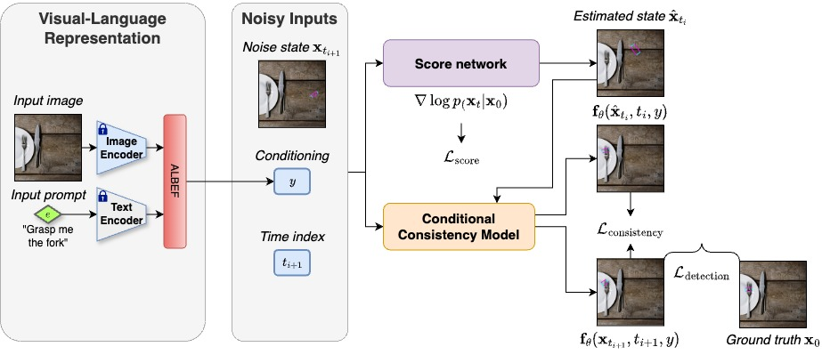

# [IROS 2024] Lightweight Language-driven Grasp Detection using Conditional Consistency Model

Implementation code for the IROS 2024 paper "Lightweight Language-driven Grasp Detection using Conditional Consistency Model"

Our paper is currently available at [this URL] (https://arxiv.org/abs/2407.17967)


We present LLGD, an improved method for object grasping based on user prompts, which is used for robot applications with fast response times, high accuracy, and the ability to work in diverse environments.



Our key idea leverages the power of a conditional consistency model for learning high-accuracy grasp poses for robots, requiring inference in just one or a few steps.

## Installation
- Create environment:
```bash
git clone https://github.com/Fsoft-AIC/Lightweight-Language-driven-Grasp-Detection.git
cd Lightweight-Language-driven-Grasp-Detection
conda create -n LLGD python=3.9
conda activate LLGD
```
- Install packages:
```bash
conda install pytorch==1.12.1 torchvision==0.13.1 torchaudio==0.12.1 cudatoolkit=11.3 -c pytorch
pip install -r requirements.txt
```

## Datasets
Our dataset can be accessed via [this link](https://airvlab.github.io/grasp-anything/docs/download/). 

## Training
We use GR-ConvNet as our default deep network. To train GR-ConvNet on different datasets, you can use the following command:

```bash
$ export CUDA_VISIBLE_DEVICES=0
$ python train_network_cm.py --dataset grasp-anything --use-depth 0 --dataset-path <path_to_dataset> --batch-size 16 --batches-per-epoch 1000 --epochs 100 --log-dir logs/ --seen 1
```


## Testing
For testing procedure, we can apply the similar commands to test different baselines:

```bash
$ python evaluate_cm.py --dataset grasp-anything --use-depth 0 --dataset-path <path_to_dataset> --iou-eval --seen 0 --network <path_to_pretrained_network>
```

## Citation

If you find our work useful for your research, please cite:
```
@inproceedings{nguyen2024lightweight,
  title={Lightweight Language-driven Grasp Detection using Conditional Consistency Model},
  author={Nguyen, Nghia and Vu, Minh Nhat and Huang, Baoru and Vuong, An and Le, Ngan and Vo, Thieu and Nguyen, Anh},
  booktitle = {IROS},
  year={2024}
}
```